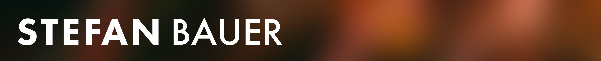

Stefan Bauer loves to bring beautiful, sustainable, flexible designs based on solid technologies to life. Driven by curiosity, he tries to find new innovative ways to solve aesthetic and functional problems.

Born and raised in Linz / Austria, he now lives and works in Vienna.

Stefan's curiosity for technologies, art, and design shaped his future early on in his life. While attending a school for mechanical engineering at the age of 16, his real passion was always around visual design and development. Fast forward a few years: he is now a designer, founder, speaker, occasional developer, and maker.

While experimenting with multi-disciplinary projects - even including architecture - he started to work on his first website in 1997. This website was named VizArts (Visual Arts) Project, which tried to set up a collaborative platform for artists on the web. The idea might have been too early, but his passion and love for the web, interaction design, collaboration, and open source remained.

After several years in the web design and technology industry and working with international agencies and customers, in 2015 Stefan founded the design studio named N8D. This brand, first established in 2010, served since then as his website and blog. The same website and Microsoft community collaboration led to multiple [Microsoft Most Valuable Professional award](https://mvp.microsoft.com/en-US/Overview) recognitions since 2016.

Stefan is also a member of the Microsoft 365 Pattern and Practices initiative. In this community-driven open-source initiative, Microsoft and external community members share their learnings and artifacts around implementation practices for Microsoft 365.

His most recent open-source project is named hTWOo, which implements Microsoft's Fluent Design language for the web in a technology - to be continued..